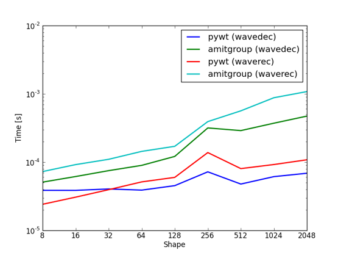

.. _wavelet1d:

.. currentmodule:: amitgroup.util.wavelet

========================
Wavelet Transforms in 1D
========================

.. warning::
    
    Our support for 1D Wavelet is an extension of our support for 2D Wavelets, which was created to outperform PyWavelets_ specifically on 2D wavelet transforms. Scroll down to the benchmarks and you will see that PyWavelets_ is faster at 1D transforms, so you might want to use that instead.

Usage
-----
You can run :func:`wavedec` or :func:`waverec` directly, or you can use the :func:`daubechies_factory` to create specialized transform functions. The former choice is actually implemented by running the latter and caching the results. The :func:`daubechies_factory` can be used to generate functions for 2D transforms as well (read more in :ref:`wavelet2d`).

.. autosummary:: 
   :toctree: generated/
     
   daubechies_factory
   wavedec
   waverec

Coefficient layout
------------------

The way we store coefficients in 1D is similar, but not exactly, like PyWavelets_ and MATLAB Wavelet Toolbox. In PyWavelets_, for a signal of length 8, we get the coefficients::

    [cA3, cD3, cD2, cD1]

The first one is associated with the scaling function and the rest three wavelet functions of different scaling. `cD3` covers the entire input signal and thus has only one dilation. The `cD1` has coefficients for the highest frequency wavelets, and has 4 dialations (or generally `log2(length)` of the input data).

Where `cA3` is the coefficient for scaling function of size 1 and `cD3` is the coefficient for the wavelet function extending the entire signal. 

In our functions, it is stored in the same order, but in a contiguous block of memory, as following::

    -----------------------------------------------------------------
    |  cA3  |  cD3  |      cD2      |              cD1              |
    | len=1 | len=1 |     len=2     |             len=4             |
    -----------------------------------------------------------------

Benchmarks
----------

Again, our support for 1D wavelets is really just to complement our support for 2D wavelets. We use the same method as for 2D, which in this case hurts performance. A comparison with PyWavelets_ makes it clear that you should probably be using that library instead if you are working with 1D signals and concerned with speed.

.. _PyWavelets: http://www.pybytes.com/pywavelets/ 
