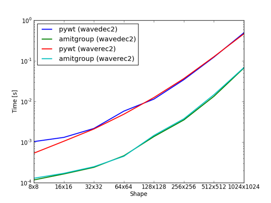

.. _wavelet2d:

.. currentmodule:: amitgroup.util.wavelet

========================
Wavelet Transforms in 2D
========================

We provide 2D periodic Daubechies wavelet transforms as a faster alternative to for instance PyWavelets_, especially if you plan to do repeated transforms on the same size input.

With our approach, you first create the transform function, where you get to specify the size of the input data, the wavelet type and how many coefficient levels that you plan to use. 

Usage
-----
Wavelets transforms can be done by first creating the wavelet decomposition and reconstruction functions using a factory function. This will precalculate as much as possible in order to make the transforms as fast as possible. An alternative is to use :func:`wavedec2` and :func:`waverec2`, which in the back-end runs the factory function and caches the result.

.. autosummary:: 
   :toctree: generated/
     
   daubechies_factory
   wavedec2
   waverec2

Speed improvements
------------------
The speed has been improved by several means. Mainly faster storage, pre-processing matrix filters and the option of not computing coefficients that you don't plan to use anyway. 

Faster storage
~~~~~~~~~~~~~~

PyWavelets_ returns a list of tuples of numpy arrays, for 2D wavelets. This takes a lot of Pythonic operations and is thus very slow. In addition to that, if you need all the coefficients in a contiguous block of memory, your incur additional conversion costs. We support only periodic wavelets, which means that each level of coefficients have 3 arrays of sides of powers of two. All these levels can fit like Russian dolls into a matrix of the same size as the input data. For instance, given an input of size 8x8, the coefficients will be returned stored as following in PyWavelets_, which is analgous to the MATLAB Wavelet Toolbox::

    [cA3, (cH3, cV3, cD3), (cH2, cV2, cD2), (cH1, cV1, cD1)]

But instead, in our code it is stored in a 8x8 array with the following layout::

    -----------------------------------------------------------------
    |  cA3  |  cH3  |               |                               |
    | (1x1) | (1x1) |      cH2      |                               |
    -----------------     (2x2)     |                               |
    |  cV3  |  cD3  |               |                               |
    | (1x1) | (1x1) |               |              cH1              |
    ---------------------------------             (4x4)             |
    |               |               |                               |
    |      cV2      |      cD2      |                               |
    |     (2x2)     |     (2x2)     |                               |
    |               |               |                               |
    |               |               |                               |
    -----------------------------------------------------------------
    |                               |                               |
    |                               |                               |
    |                               |                               |
    |                               |                               |
    |              cV1              |              cD1              |
    |             (4x4)             |             (4x4)             |
    |                               |                               |
    |                               |                               |
    |                               |                               |
    |                               |                               |
    |                               |                               |
    -----------------------------------------------------------------

Throw-away coefficients
~~~~~~~~~~~~~~~~~~~~~~~

Another speed improvement can be made if you plan to throw away some of the highest frequency coefficients. For instance, if you know that in the above 8x8 transform, you know you do not need any of the 4x4 coefficients, you can specify that as following::

    >>> wavedec2, waverec2 = ag.util.wavelet.daubechies_factory((8, 8), wavelet='db2')
    >>> coefs = wavedec2(np.ones((8, 8)), levels=2)
    >>> print coefs.shape
    (4, 4)

We are able to offer these speed improvements by skipping the high-pass filters for the unnecessary coefficient levels, and combining several low-pass filters into one. The filtering is implemented using matrix multiplication, and the matrices (filters) needed are precomputed in the factory functions. For high-dimensional matrices, we take advantage of SciPy's sparse matrix functionality.

Coefficient conversions
-----------------------

.. note::

    These conversions will hurt performance, and should be avoided for performance-sensitive code.

The coefficients arrays can be converted to and from the same layout as PyWavelets_, which is great for comparison or migration:

.. autosummary:: 
   :toctree: generated/
     
   contiguous_to_structured 
   structured_to_contiguous

If you ever need to plot the coefficient on one axis, it can be good to have a flattened array, that is sorted in terms of the different levels of coefficients (notice that simply running ``flatten()`` on coefficients will not achieve this):

.. autosummary:: 
   :toctree: generated/
     
   smart_flatten
   smart_deflatten 

Benchmarks
----------

PyWavelets_ is a great library with a rich feature set. However, even though it is largely Cython-powered, the performance can be lacking for 2D transforms (where my profiler tells me that a lot of time is spent shuffling memory, such as running ``transpose()``), and especially if you are running small-image transforms, but *a lot* of them:

The benchmark tests the D4 (``'db4'``) wavelet. This benchmark does not include the time it takes to create the functions using the factory. However, this is not a significant time and becomes neglible compared to module loading costs in Python.

.. _PyWavelets: http://www.pybytes.com/pywavelets/ 
